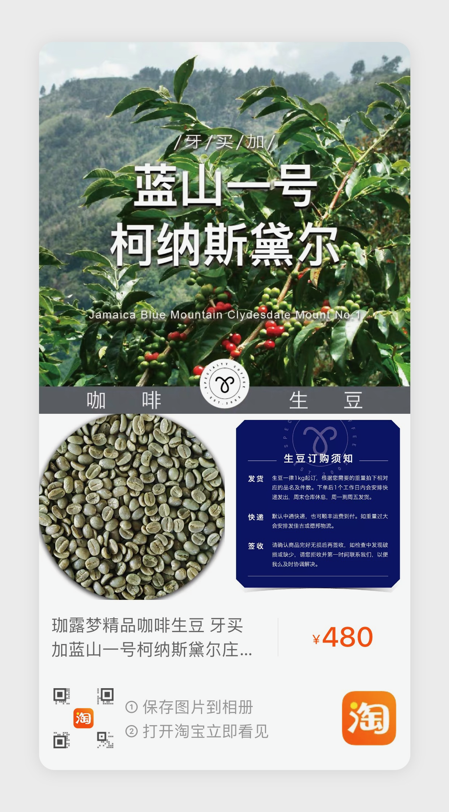

# 基本信息

|品名|品种|产地/产区|庄园|海拔|产季|等级|含水率|密度|处理方法|
|---|----|-------|---|----|---|---|------|---|-------|
|牙买加蓝山一号|铁皮卡|牙买加-圣安德鲁教区|柯纳斯黛尔庄园|1000-1250|2019/2020|N/A|N/A|N/A|全水洗|

# 采购信息

|采购编号|重量|采购来源|价格|单价(RMB/g)|采购日期|到货日期|
|-------|---|-------|---|-----------|------|-------|
|PR2|1 kg|https://www.taobao.com/|￥480.00|￥0.48|2020-07-16|2020-07-19|

# 评价

草本味，色泽一致，均匀，大小较一致

# 备注

当时采购的商品在淘宝上已下架
